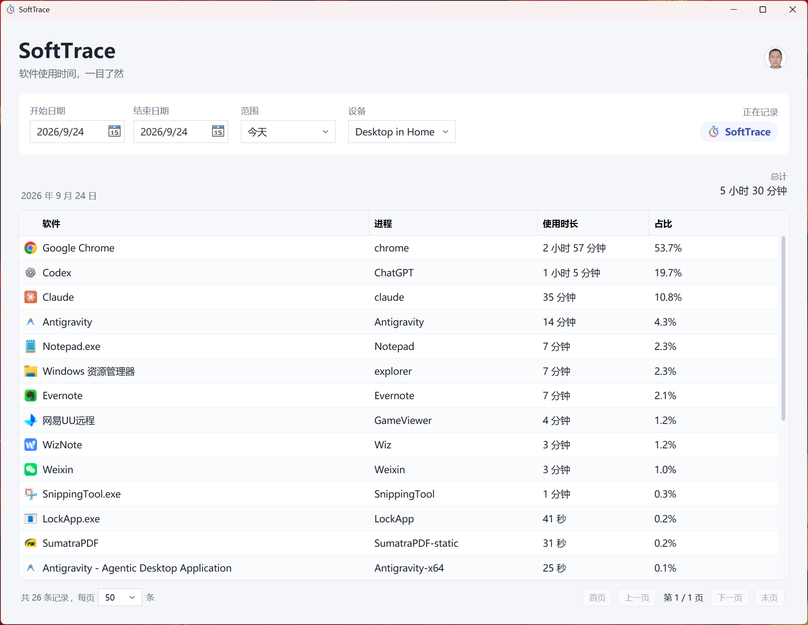

<p align="center">
  
</p>

<h1 align="center">Soft Trace</h1>

<p align="center"><strong>本地记录软件使用时间，清晰查看每日排行与使用习惯。</strong></p>

<p align="center">
  <a href="https://github.com/yuzhounh/soft-trace/releases/latest"></a>
  <a href="LICENSE"></a>
  
  
</p>

<p align="center">
  <a href="https://github.com/yuzhounh/soft-trace/releases/latest">下载发布版</a> · <a href="#开发与验证">快速开始</a> · <a href="LICENSE">开源协议</a>
</p>

Soft Trace 是一个轻量级 Windows 软件使用时间追踪工具。它在本地记录当前前台软件，并按日期汇总使用时长。

<p align="center">
  
</p>

## 功能特点

- 自动识别当前前台软件（不记录网页、窗口标题或键盘内容）
- 从可执行文件提取软件图标，以紧凑排行显示
- 原创彩色秒表应用图标，并内置多种 Windows 显示尺寸
- 1 秒轮询，软件切换时生成活动区间
- 默认连续空闲 3 分钟停止计时；Idle、锁屏和睡眠只会切断区间，不出现在统计中
- SQLite 本地持久化，使用 UTC、WAL 和 15 秒检查点
- 今天、近 7 天、近 30 天或自定义日期范围的软件使用排行
- 系统托盘常驻、暂停/继续记录、单实例运行
- 异常退出后按最后检查点自动封闭未完成区间
- 采集写入失败时暂停并显示错误，可从托盘继续记录；故障空档不会补计时
- 使用系统浏览器完成 Google 登录，采用 OAuth 2.0 PKCE
- Firebase Firestore 每分钟自动双向同步，启动与登录后立即同步
- 每台电脑使用稳定设备 ID，可查看全部设备或单台设备统计
- 同步区间使用稳定 `sync_id` 去重，重复拉取不会重复累计
- Firebase 刷新令牌使用当前 Windows 用户的 DPAPI 加密保存
- 可直接导入 ManicTime 备份 ZIP 或 `ManicTimeReports.db`
- 导入时合并同一应用的连续记录，并只填补 Soft Trace 尚未覆盖的时间

## 下载

从 [GitHub Releases](https://github.com/yuzhounh/soft-trace/releases) 下载 Windows x64 版本：

- `SoftTrace-v0.3.2-win-x64-Setup.exe`：推荐普通用户使用的安装版，提供开始菜单快捷方式、可选桌面快捷方式和标准卸载入口。
- `SoftTrace-v0.3.2-win-x64-Portable.exe`：绿色便携单文件，无需安装即可运行。

`v0.3.2` 改善窄窗口布局，四列表格按比例随窗口伸缩，支持拖动相邻列并保存比例；长名称以省略号显示，悬停可查看全称。同时修复托盘界面的同步重入问题并更新应用图标。升级时先从托盘退出旧版，再安装或替换程序；保留原有本地数据库和设置，无需卸载或删除数据。

两个版本均为 Windows x64 自包含程序，不要求另行安装 .NET。关闭主窗口只会隐藏到系统托盘；需要彻底退出时，请右键托盘图标并选择“退出”。卸载安装版时默认保留本地使用记录，也可在卸载提示中选择一并删除。

数据库与运行日志保存在：

```text
%LOCALAPPDATA%\SoftTrace\softtrace.db
%LOCALAPPDATA%\SoftTrace\softtrace.log
%LOCALAPPDATA%\SoftTrace\firebase-sync.json
```

SQLite 始终是本机采集的权威副本；断网期间继续记录，联网后自动补传。`firebase-sync.json` 只保存账号信息和经 DPAPI 加密的 Firebase 刷新令牌，不保存 Google 密码。

若主窗口显示“记录失败，已暂停”，将鼠标移到状态文字可查看原因，完整错误写入 `softtrace.log`。解决问题后，右键托盘选择“继续记录”。仍无法写入时会保持暂停；成功恢复时，旧区间按最后已保存的检查点封闭，从新的观察重新计时。

## 导入 ManicTime 历史数据

点击主窗口右上角的“导入 ManicTime”，选择 ManicTime 生成的备份 ZIP 或解压后的 `ManicTimeReports.db`。导入记录归到当前电脑，并参与正常的本地统计与云同步。

Soft Trace 数据优先：导入器会从每条 ManicTime 活动中扣除当前电脑已有记录覆盖的时间，完全重叠的记录跳过，部分重叠的记录只保留未覆盖部分。导入 ID 是稳定的，因此重复选择同一备份不会重复累计。

## 开发与验证

```powershell
git clone https://github.com/yuzhounh/soft-trace.git
cd soft-trace
.\run.ps1
.\build.ps1
```

`run.ps1` 使用系统级 .NET 10 SDK 启动开发版；`build.ps1` 会运行 Release 构建、核心与采集恢复测试，并生成自包含便携版与 Inno Setup 安装包。构建或测试失败会停止打包。构建安装包需要 Inno Setup 6。

## 当前边界

当前源码支持可靠采集、软件排行、ManicTime 历史导入、Firebase 多设备同步、开机自启及 JSON 数据导入/导出；暂不包含每日时间轴或 CSV 导出。

## 相关项目

- [timelens-chrome-extension](https://github.com/yuzhounh/timelens-chrome-extension)：统计浏览器中的网站访问时间，可与软件使用统计互补。
- [focus-pace](https://github.com/yuzhounh/focus-pace)：管理专注与休息节奏的 Windows 工具。

## 开源协议

本项目采用 [MIT 许可证](LICENSE)。
